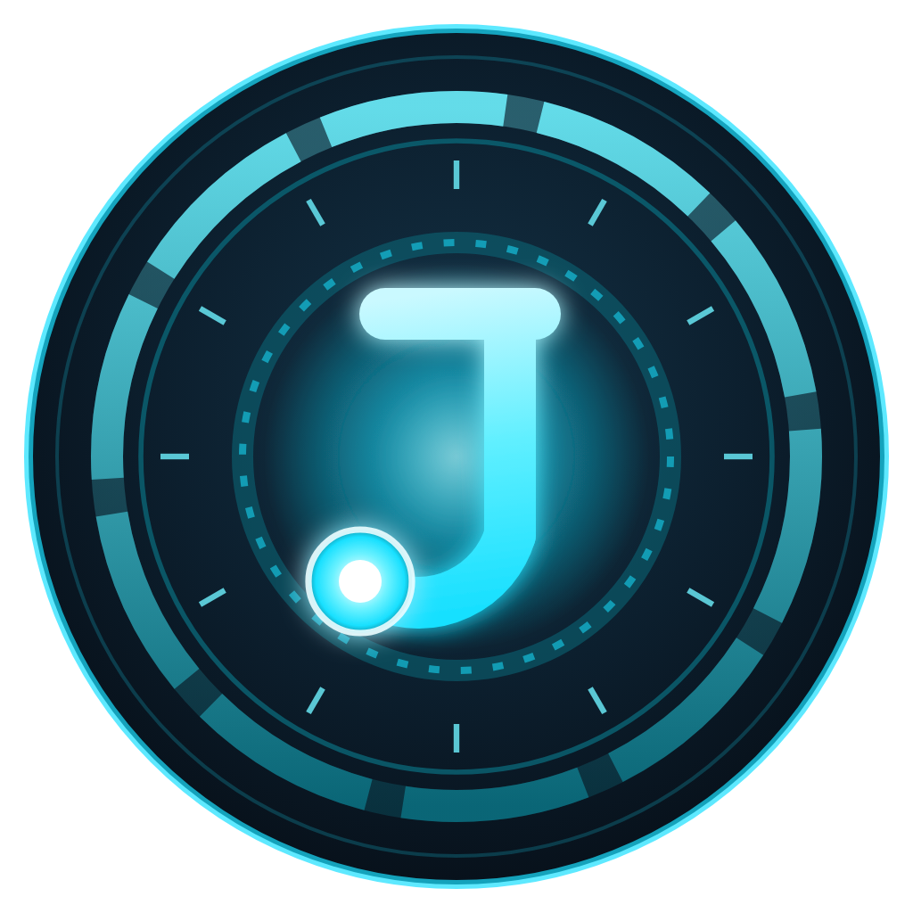
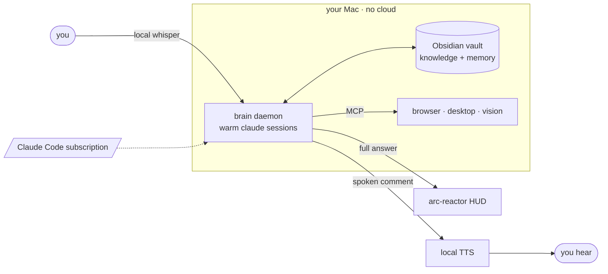

<div align="center">



# J.A.R.V.I.S.

**The AI from the films, running on the Claude Code subscription you already have.**

You talk. It answers in a real voice while the full detail lands on screen.

[](#requirements)
[](#voice)
[](LICENSE)

</div>

Jarvis listens, speaks, sees, and acts on your Mac. An always-on local brain runs the `claude` CLI on your existing Claude Code login, an Obsidian vault gives it durable memory, and a floating arc-reactor HUD shows the work. Voice runs entirely on-device. No paid API, no cloud lock-in.

It comments out loud while the full answer lands on screen, like the films, not a wall of read-aloud text. It ships safe: power stays off until you turn it on, after reading [SECURITY.md](SECURITY.md).

## Quickstart

```bash
git clone https://github.com/Grandillionaire/jarvis.git && cd jarvis
./install.sh        # checks deps, fetches the local speech model, scaffolds your vault — no keys
cd app && npm start # the orb appears, bottom-right
```

Tap the orb and talk. That is a full voice assistant running on nothing but your Claude Code plan. Nicer voices, a "Jarvis" wake word, and browser or desktop control are all opt-in, covered in [docs/SETUP.md](docs/SETUP.md).

**Hotkeys**   `⌘⇧J` show or hide  ·  `⌘⇧H` expand HUD  ·  `⌘⇧T` change the look  ·  `⌘⇧Q` quit

## How it works

The Electron overlay is a thin client: the arc-reactor HUD, an audio-reactive orb, multiple themes. The brain is an always-on `launchd` daemon of warm `claude` sessions, so it survives the UI closing and can act on its own. Most turns route to Sonnet; the hard ones, code and deep reasoning, escalate to Opus. Memory is plain markdown in a private git repo, re-injected every session. Voice in and out runs locally; the hands are opt-in MCP servers.



## What it can do

Everything below is opt-in and guard-railed. Jarvis ships without unrestricted permissions or computer-use, and you turn power on deliberately.

- **Voice.** Tap the orb or use a "Jarvis" wake word, then speak and it answers in a real voice over an audio-reactive orb.
- **Memory.** An Obsidian markdown vault holds its knowledge and long-term memory. Each conversation auto-distills into a private, versioned note it reloads next session.
- **Calendar and email.** Read, create, and update Google and Apple Calendar plus Reminders. Drafts email, never sends.
- **Hands and eyes.** Drives the browser with Playwright, controls macOS apps, windows, and files, and sees the screen.
- **Visuals.** Ask for a chart or diagram and it makes one, in matplotlib, Mermaid, or interactive HTML.
- **Morning brief.** A spoken 8am rundown of your calendar, inbox, and open loops, with no window open.
- **Autonomous coding.** A `/goal` loop with caps, timeouts, and kill-switches. It never pushes.

## Voice

The default tier is fully local, offline, and free. Everything above it is optional.

| Tier | Speech to text | Text to speech | Cost |
|---|---|---|---|
| Default | whisper.cpp, on-device | macOS `say` | free, offline, no key |
| Quality | `small.en` model | [Kokoro-FastAPI](https://github.com/remsky/Kokoro-FastAPI), local | free, one extra service |
| Premium | ElevenLabs Scribe | ElevenLabs | paid, opt-in |

A "Jarvis" wake word is optional via Picovoice; otherwise, tap the orb.

## Requirements

macOS, on Apple Silicon or Intel. [Claude Code](https://claude.com/claude-code) on a paid plan (Pro or Max), signed in. Node 18+. [Obsidian](https://obsidian.md) with its Local REST API plugin. One Homebrew line:

```bash
brew install ffmpeg whisper-cpp coreutils
```

The installer checks all of it and downloads the ~142 MB local speech model on first run.

## A note on power

When you opt into full capability with `JARVIS_YOLO=1`, Jarvis becomes a real agent with shell, file, and network access that also reads untrusted email and web. Run that mode in a VM or a throwaway account, and read [SECURITY.md](SECURITY.md) first.

## Contributing

Issues and PRs welcome, see [CONTRIBUTING.md](CONTRIBUTING.md). Especially wanted: Linux and Windows ports, more local-voice backends, and new MCP hands.

## License

[MIT](LICENSE), provided as is, without warranty. You are responsible for how you run it.

<sub>Not affiliated with, endorsed by, or sponsored by Marvel, Disney, or Anthropic. "J.A.R.V.I.S." is used as a cultural reference to a fictional AI assistant; this is an independent open-source project. "Claude" and "Claude Code" are trademarks of Anthropic.</sub>

<div align="center"><sub>If it's useful, a star helps others find it.</sub></div>
