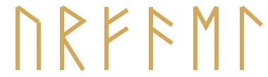
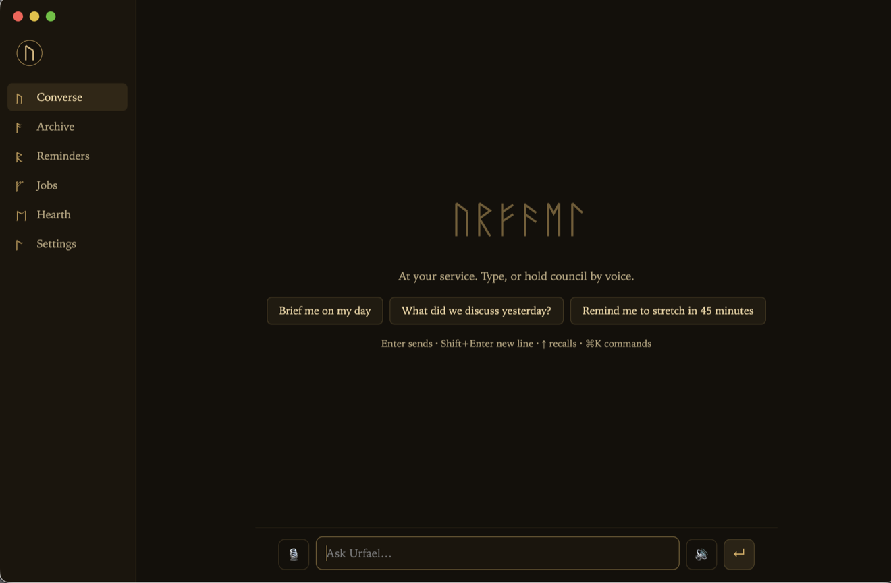
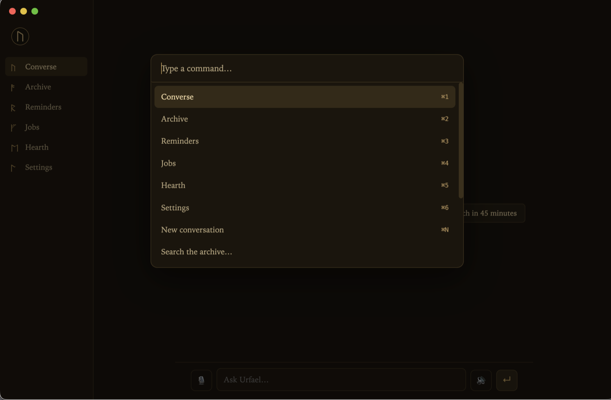

<div align="center">


# U R F A E L



**A personal, voice-capable AI assistant you run on your own machine — built security-first, on the flat-rate Claude subscription you already have. No inbound port to attack. No per-token meter running.**

It listens and speaks locally, sandboxes every autonomous action fail-closed, allowlists who can reach it, regression-tests itself against its own adversarial attacks, and tells you plainly what's battle-tested and what isn't.

[](#install)
[](#install)
[](#voice)
[](#security)
[](LICENSE)

<br/>



<sub>The Console — chat with live tool activity, push-to-talk, archive, reminders, jobs, settings. One window, keyboard-first.</sub>

</div>

> The other self-hosted assistants optimize for channel count and star count. Urfael optimizes for not getting owned — and for not lying to you about what it can do.

---

## Contents

- [Why Urfael](#why-urfael) · [the honest comparison](#how-it-compares)
- [Highlights](#highlights)
- [Security model](#security) — the moat
- [Install](#install) & [Quick start](#quick-start)
- [The surfaces](#the-surfaces): Console · orb · TUI · web dashboard
- [Channels](#channels) · [Voice](#voice) · [Memory & recall](#memory--recall) · [Autonomous coding](#autonomous-coding) · [Cost](#cost)
- [What's lightly tested](#whats-lightly-tested) — read this
- [Who this is *not* for](#who-this-is-not-for)
- [The name](#the-name) · [Contributing](#contributing) · [License](#license)

## Why Urfael

Urfael is an always-on local brain that runs your installed `claude` CLI as a subprocess — so it rides your existing Claude Code login with **no API key and nothing to connect**. An Obsidian vault is its archive; a private git repo is its memory; voice in and out runs on-device. It answers in a real voice while the full written answer lands on screen, stays silent unless something needs you, and ships with power **off** until you turn it on.

What makes it different isn't a feature count — it's the blast radius. Nothing listens on a network port. Every remote message is allowlisted to you before the brain sees it and sandboxed read-only by default. Autonomous coding runs in a throwaway container or on a remote host, never with your secrets mounted. And the security-critical paths ship with adversarial regression tests that try to break them — the literal attacks a reviewer found, frozen so they can never regress.

### How it compares

Every win below is real, and every gap is admitted in the same grid — the honesty is the point. `✅` solid · `⚠️` partial / by-design tradeoff · `❌` absent.

| Capability | **Urfael** | Hermes | OpenClaw |
|---|---|---|---|
| No inbound network port | ✅ none open¹ | ⚠️ varies | ⚠️ inbound DMs / gateway |
| Fail-closed sandboxes | ✅ Docker/SSH, default-deny | ⚠️ optional | ⚠️ optional Docker |
| Ships adversarial regression tests | ✅ attacks itself | ❌ | ❌ |
| Owner-allowlist by default | ✅ all channels, before the brain | ⚠️ pairing | ✅ pairing |
| Local, on-device voice + presence | ✅ whisper + say, orb HUD | ⚠️ TTS/STT | ⚠️ cloud-leaning |
| Flat-rate cost (no per-token meter) | ✅ your Claude subscription | ❌ per-token APIs | ❌ per-token APIs |
| Desktop app · TUI · web dashboard | ✅ all three | ⚠️ TUI + desktop | ✅ apps + canvas |
| Chat channel breadth | ⚠️ 8, curated | ✅ many | ✅ 20+ |
| Model flexibility | ⚠️ Claude-only, by design | ✅ 200+ models | ✅ many providers |
| Battle-tested at scale | ⚠️ small, and we say so | ✅ large | ✅ very large |
| OS coverage | ⚠️ macOS solid, Linux newer | ✅ broad | ✅ broad |

<sub>¹ The lone exception is the optional WhatsApp bridge, whose webhook binds to `127.0.0.1` behind your own tunnel and is HMAC-verified. ² Competitor cells are best-effort fair: both sandbox optionally and both default to DM pairing.</sub>

**We win where it counts for a machine that lives on your desk and acts on your behalf: blast radius, cost predictability, and not overstating maturity.**

## Highlights

Benefit first, mechanism second. Everything is opt-in and guard-railed.

- **Nothing to attack.** The brain speaks only over a `0600` unix socket — no TCP port, nothing the LAN or the internet can reach. ([details](#security))
- **It heard you, locally.** Push-to-talk in the Console or a spoken wake word; whisper.cpp transcribes and macOS `say` (or local Kokoro) speaks — no cloud STT/TTS by default. The spoken remark streams sentence-by-sentence, and a slow answer gets an "On it, sir." instead of silence.
- **Flat rate, full stop.** It runs on your Claude Code subscription. Idle costs nothing beyond it; there is no per-token surprise. Token use and an estimated daily/7-day/30-day spend are visible in the app, the dashboard, and `urfael status`.
- **Memory that compounds.** Each conversation auto-distills into durable memory, lessons from its mistakes, and a model of who you are — all re-read every session. Ask "what did I say about the Berlin trip?" and it **ranks its own history (BM25)** and cites the date.
- **Skills that grow — installed paranoid.** It writes down procedures it figures out and reuses them; a curator prunes stale ones. Install one from a URL and it **previews the full content and runs a static safety scan first** (dangerous flags, exfil URLs, prompt-injection, hidden unicode), refuses to auto-install anything flagged, and never executes a skill.
- **Quietly proactive.** "Remind me in 20 minutes" / "every morning at 8" just works — fired as a notification, spoken aloud, pushed to your phone, every window closed. An opt-in heartbeat runs your `HEARTBEAT.md` checklist and stays silent unless something genuinely needs you.
- **It attacks itself.** The security-critical paths ship with regression tests built from real adversarial findings (allowlist bypasses, SSRF, parser desync, DoS) so they can't quietly rot.
- **It tells you what it doesn't know.** See [What's lightly tested](#whats-lightly-tested). That section exists on purpose.

## Security

> [!IMPORTANT]
> Urfael ships **safe by default**: no unrestricted shell, no computer-use, read-only remote turns. You turn power on deliberately, after reading [SECURITY.md](SECURITY.md).

The brain is a local daemon reachable only through a `0600` unix socket — **it never opens a TCP port**. The topology is one-way: Urfael reaches out (to your `claude` login, to chat APIs it polls); nothing reaches in.

- **Allowlist before the brain.** Every message from Telegram/Discord/Slack/iMessage/Email/Matrix/Signal/WhatsApp is checked against *your* id and dropped+audited otherwise — before a single token reaches the model. Remote turns run in a **read-only sandbox** (read + search your vault; no write, no shell, no network egress) and are wrapped in a nonce-framed untrusted-data envelope against prompt injection.
- **Fail-closed everything.** An unknown channel resolves to the most-restricted profile, not the least. A malformed request is rejected, not guessed.
- **Sandboxed autonomy.** The `/goal` loop runs on the host, in a throwaway `--network none` Docker container (only the `claude` auth files are staged in — never your `bridge.env`/API keys), or on a remote box over SSH.

> [!WARNING]
> Full capability (`URFAEL_YOLO=1`) gives the agent an unrestricted shell that also reads untrusted email and web. Run that mode **only** in a VM, container, or throwaway account.

## Install

> [!NOTE]
> **Prerequisites, stated honestly:** a [Claude Code](https://claude.com/claude-code) subscription (Pro or Max), signed in. macOS on Apple Silicon or Intel is the primary, best-tested target; **Linux is supported but newer**. [Obsidian](https://obsidian.md) with its Local REST API plugin for the vault. Docker only if you want sandboxed autonomous coding.

```bash
git clone https://github.com/Grandillionaire/urfael.git && cd urfael   # clone anywhere
./install.sh        # checks deps, fetches the local speech model (checksum-pinned), scaffolds your vault — no keys
cd app && npm start # the Console opens
```

`install.sh` is read-it-first friendly: it **never** auto-installs heavy software or enables anything risky. It writes config templates (`chmod 600`), scaffolds `~/Urfael` (your vault) and a private local `~/Urfael-memory` git repo, links the `urfael` CLI, and writes the service files (launchd on macOS, `systemd --user` on Linux) **without loading them**. One Homebrew line covers the rest:

```bash
brew install ffmpeg whisper-cpp coreutils       # macOS
# Linux: sudo apt install ffmpeg espeak-ng libnotify-bin grim  (+ build whisper.cpp)
```

The brain uses Claude Code's model **aliases** (`sonnet` for most turns, escalating to `opus` for code & deep reasoning), so it always tracks the latest models your plan supports. Opus needs **Max**; on **Pro**, set `URFAEL_OPUS_MODEL=sonnet`. Full setup — voice tiers, connectors, bridges, Linux — is in [docs/SETUP.md](docs/SETUP.md).

### Quick start

```bash
launchctl load -w ~/Library/LaunchAgents/com.urfael.daemon.plist   # macOS: the always-on brain
# Linux:  systemctl --user enable --now urfael-daemon
cd app && npm start                                                # the Console
```

Tap the mic and talk, or just type. That's a full voice assistant running on nothing but your Claude Code plan.

**Hotkeys**  `⌘⇧O` open the Console · `⌘⇧Q` quit · `⌘K` command palette · `⌘1–6` views · orb mode adds `⌘⇧U` show/hide · `⌘⇧T` look

## The surfaces

One brain, four ways to reach it — all thin clients of the same daemon, so a conversation started by voice shows up in the Console, the CLI, and your phone alike.

<table>
<tr>
<td width="50%">

**Console** — the desktop app. Streamed replies with one-line tool activity, push-to-talk, the full conversation archive, reminders, background jobs, live cost (Hearth), and settings. Keyboard-first with a `⌘K` command palette.

</td>
<td width="50%">



</td>
</tr>
</table>

<details>
<summary><b>Orb HUD</b> · <b>terminal</b> · <b>full-screen TUI</b> · <b>web dashboard</b> — expand</summary>

- **Orb HUD** (`URFAEL_ORB=1`) — an ambient, click-through seeing-stone in the corner of your screen with four looks (`sigil`, `rune`, `ember`, `eye`). Speak the wake word and talk hands-free.
- **Terminal** — `urfael "summarize my inbox"` streams the answer live; `status`, `jobs`, `reminders`, `remind`, `sessions search`, `skills`, `stop`, `dashboard` manage the rest. `Ctrl+C` stops a turn.
- **`urfael tui`** — a no-deps full-screen terminal cockpit: streamed transcript with live tool activity, a status bar, `Esc` to stop, and it always leaves your terminal clean.
- **Web dashboard** — `urfael dashboard` opens a token-gated localhost page (bound to `127.0.0.1` only, constant-time token, no path serving). It's an **installable, responsive PWA**, so over a tunnel it's a real phone app — the browser surface the others have, locked down harder.

</details>

## Channels

Drive Urfael from **8 owner-allowlisted channels** — text or **voice memos** (transcribed locally, never by a cloud STT). Every one is sandboxed read-only by default and gated to your id before the brain sees anything.

<details>
<summary>Telegram · Discord · Slack · iMessage · Email (draft-only) · Matrix · Signal · WhatsApp — setup notes</summary>

- **Telegram / Discord / Slack / Matrix** — bot token + your id; outbound only, no inbound port.
- **iMessage** (macOS) — reads `chat.db` read-only for your allowlisted handle, replies via AppleScript. Needs Full Disk Access.
- **Email** — IMAP IDLE, **draft-only** (it writes replies to your Drafts, never sends).
- **Signal** — wraps `signal-cli`.
- **WhatsApp** — the Cloud API's webhook is the one inbound surface: it binds `127.0.0.1` behind your own tunnel and is HMAC-verified.

See [docs/SETUP.md](docs/SETUP.md). Calendar/Gmail connectors (read briefings, draft email — never send) come from your Claude account.

</details>

## Voice

The default tier is fully local, offline, and free.

| Tier | Speech-to-text | Text-to-speech | Cost |
|---|---|---|---|
| **Default** | whisper.cpp, on-device | macOS `say` / Linux `espeak-ng` | free, offline, no key |
| Quality | `small.en` | [Kokoro-FastAPI](https://github.com/remsky/Kokoro-FastAPI), local | free, one extra service |
| Premium | ElevenLabs Scribe | ElevenLabs | paid, opt-in |

A spoken wake word is optional via Picovoice — any built-in keyword works out of the box, or train a custom "Urfael" keyword free at console.picovoice.ai.

## Memory & recall

The vault holds its knowledge; a private git repo holds what it learns. Every conversation, from every surface, is archived as plain JSONL and **ranked with BM25** on recall — `urfael sessions search <query>` from any terminal, or the brain greps its own history when you ask. An end-of-conversation pass distills durable memory, lessons, and a `USER.md` model of who you are; an opt-in per-turn review and an N-day skill curator keep it sharp.

## Autonomous coding

> [!WARNING]
> The `/goal` loop can edit and commit code on its own. It runs with caps, timeouts, kill-switches, and **never pushes** — but for anything beyond a trusted local repo, use `--sandbox docker` (throwaway, `--network none`, no secrets mounted) or `--sandbox ssh` (a remote box). Supervise the first run.

Hand off long work to detached, cancellable background jobs (autonomous coding, deep research) that don't tie up the conversation and push your phone when done.

## Cost

It runs on a flat-rate subscription, so there's nothing to meter — but you can still see usage. Token counts and an **estimated** daily/7-day/30-day spend (rate is env-overridable, never asserted as fact) show up in the Console's Hearth panel, the dashboard, and `urfael status`.

## What's lightly tested

Honesty is a feature here, so this section exists. As of now:

- **Every feature is verified end-to-end** by an in-repo harness (`npm run e2e`) against a live daemon: streamed conversation, abort + recovery, ranked recall, reminders firing, jobs completing, the heartbeat, all CLI commands, the dashboard's full attack battery, voice synthesis, all 8 bridges degrading cleanly, and the skill-hub SSRF refusal + scanner — plus 44 unit tests, several of them adversarial security regressions.
- **Not yet exercised against real accounts:** the live relay of the Matrix, Signal, and WhatsApp bridges (their pure parsing/allowlist logic *is* unit-tested). Treat them as code-complete and reviewed, not battle-hardened.
- **Linux is newer than macOS.** The headless core, voice, and GUI run there, but it has far less mileage.
- **Real-world scale is small.** This is a personal tool, honestly stated — not a 100k-deployment veteran. That's the one thing only time and users add.

## Who this is *not* for

If you want 20 chat channels and any model under the sun, use OpenClaw or Hermes — they're excellent at breadth. If you want the **smallest possible blast radius**, a **flat bill**, **local voice**, and a tool that's **straight with you about its limits**, stay.

## The name

Urfael is an original character: an old intelligence sworn to one person, woken into a machine. The name is a Sindarin-styled coinage; the mark is the **Uruz rune (ᚢ)** — the "U" of the Elder Futhark, the real, public-domain runic script that fantasy dwarf-runes were drawn from. No affiliation with any film, game, or estate is implied.

## Contributing

Issues and PRs welcome — see [CONTRIBUTING.md](CONTRIBUTING.md). Especially wanted: a hero demo GIF, a Windows port, hardening of the (newer) Linux paths, real-world reports on the Matrix/Signal/WhatsApp bridges, more local-voice backends, and new MCP hands.

## License

[MIT](LICENSE), provided as is, without warranty. You are responsible for how you run it.

<sub>An independent open-source project, not affiliated with, endorsed by, or sponsored by Anthropic. "Claude" and "Claude Code" are trademarks of Anthropic.</sub>

<div align="center"><sub>If it earns its place on your machine, a star helps others find it.</sub></div>
