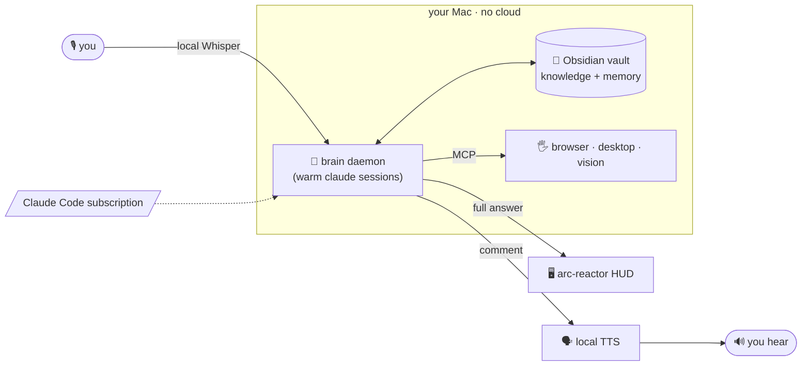

<div align="center">


# J.A.R.V.I.S.

### Your own AI from the films — running on the Claude Code subscription you already have.

A voice-driven personal assistant with an always-on local brain, an Obsidian second-brain for memory,
and a floating arc-reactor HUD that listens, speaks, sees, and acts on your Mac.

**No paid API. No cloud lock-in. It just runs on your machine.**

<br/>


</div>

---

## Why it's different

Most "AI assistants" are a thin wrapper around an API you pay for, that forgets you between chats.
Jarvis is the opposite:

- 🗣️ **Talk to it, it talks back** — and it *comments* on the answer while the full detail lands on
  your screen, just like in the films.
- 🧠 **It remembers** — every conversation distills into a private, versioned memory it reloads next time.
- 🔌 **Zero API keys to start** — voice is 100% local (macOS `say` + on-device Whisper). The brain is the
  `claude` CLI on **your existing Claude Code subscription.** Nothing else to pay for.
- 🖐️ **It actually does things** — reads your calendar/email, controls the browser and desktop, sees your
  screen, generates charts and diagrams, and can code autonomously (all opt-in, all guard-railed).
- 🔒 **Safe by default** — ships *without* unrestricted permissions or computer-use; you turn power on
  deliberately, after reading [SECURITY.md](SECURITY.md).

> ⚠️ **Read [SECURITY.md](SECURITY.md) first.** When you opt into full power, Jarvis is an agent with real
> shell, file, and network access that reads untrusted email/web — so run that mode in a VM or throwaway
> account. MIT, **no warranty**, your own risk.

## What it can do

| | |
|---|---|
| 🎙️ **Voice** | Wake word or tap → speak → it answers in a real voice. Barge-in, streaming, audio-reactive orb. |
| 🧠 **Brain** | Always-on local daemon of warm Claude Code sessions; routes most turns to Sonnet and escalates the hard ones (code, deep reasoning) to Opus. |
| 📓 **Memory** | An Obsidian markdown vault is its knowledge + long-term memory; auto-distilled and reloaded every session. |
| 🖥️ **HUD** | A transparent, click-through arc-reactor overlay streaming live activity + answers. Three+ looks. |
| 📅 **Calendars & email** | Read/create/update Google **and** Apple Calendar + Reminders; draft (never send) email. |
| 👁️ **Hands & eyes** | Drive the browser, control macOS apps/windows/files, see the screen — opt-in MCP servers. |
| 📊 **Visuals** | Ask for a chart or diagram and it makes one (matplotlib / Mermaid / interactive HTML). |
| ☀️ **Proactive** | A spoken morning brief at 8am — calendar + email + open loops — with no window open. |
| 🤖 **Autonomous coding** | A guard-railed `/goal` loop (caps, timeouts, kill-switches) that never pushes. |

## Quickstart

```bash
git clone https://github.com/Grandillionaire/jarvis.git && cd jarvis
./install.sh        # checks deps, downloads the local speech model, scaffolds your vault — no keys
cd app && npm start # the orb appears, bottom-right
```

That's it — **a full voice assistant on nothing but your Claude Code plan.** Tap the orb and talk.
Optional upgrades (nicer voice, a "Jarvis" wake word, browser/desktop control) are all opt-in — see
**[docs/SETUP.md](docs/SETUP.md)**.

**Keys:** `⌘⇧J` show/hide · `⌘⇧H` expand HUD · `⌘⇧T` change the look · `⌘⇧Q` quit.

## How it works



The Electron **overlay** is a thin client; the **brain** is an always-on `launchd` daemon running the
`claude` CLI, so it survives the UI closing and can act proactively. Memory is plain markdown in a private
git repo, re-injected each session. Voice in/out runs locally; hands are MCP servers.

## Voice tiers (all but the last are free & local)

| Tier | Speech-to-text | Text-to-speech | Cost |
|---|---|---|---|
| **Default** | whisper.cpp (on-device) | macOS `say` | **$0, offline, no key** |
| Quality | `small.en` model | [Kokoro](https://github.com/remsky/Kokoro-FastAPI) (local) | $0, one extra service |
| Premium | ElevenLabs Scribe | ElevenLabs | paid, opt-in |

## Requirements
macOS · [Claude Code](https://claude.com/claude-code) + a claude.ai login · Node 18+ · `brew install ffmpeg whisper-cpp coreutils` · [Obsidian](https://obsidian.md) + the Local REST API plugin. The installer checks everything and downloads the ~142 MB speech model.

## Contributing
PRs and issues welcome — see [CONTRIBUTING.md](CONTRIBUTING.md). Especially wanted: Linux/Windows ports,
more local-voice backends, and new MCP "hands."

## License
[MIT](LICENSE) — provided **as is, without warranty**. You are responsible for how you run it.

<sub>Not affiliated with, endorsed by, or sponsored by Marvel, Disney, or Anthropic. "J.A.R.V.I.S." is used
as a cultural reference for a fictional AI assistant; this is an independent open-source project, and
"Claude Code" / "Claude" are trademarks of Anthropic.</sub>

<div align="center"><sub>Built with Claude Code. If this is useful, a ⭐ helps others find it.</sub></div>
